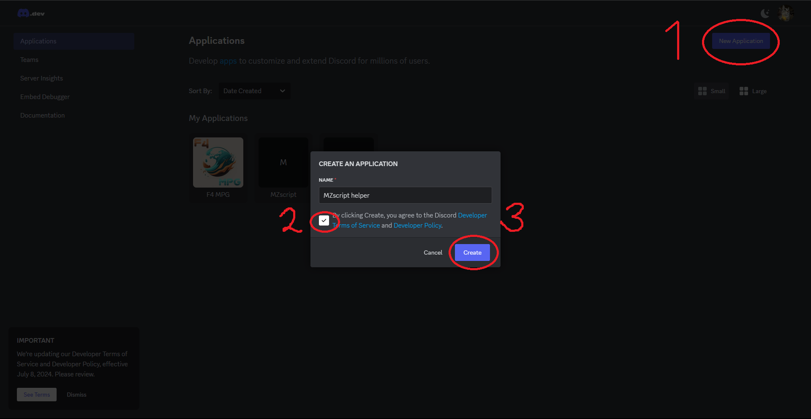
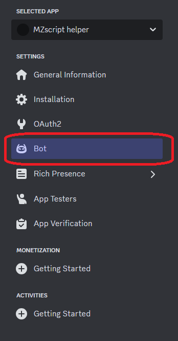
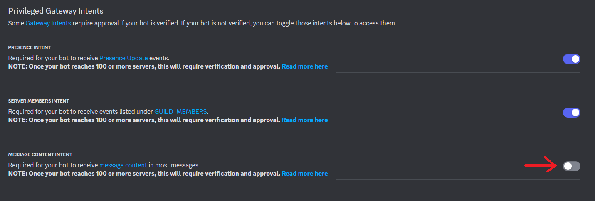
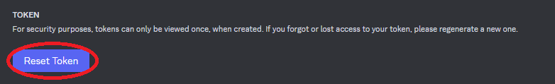
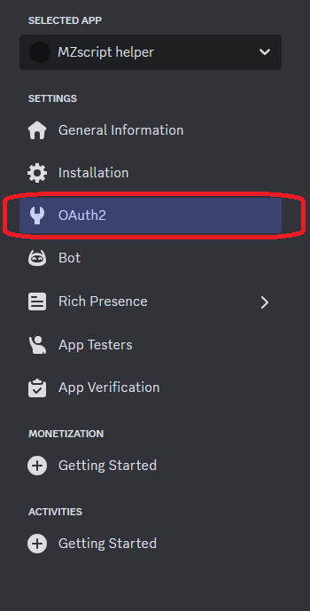
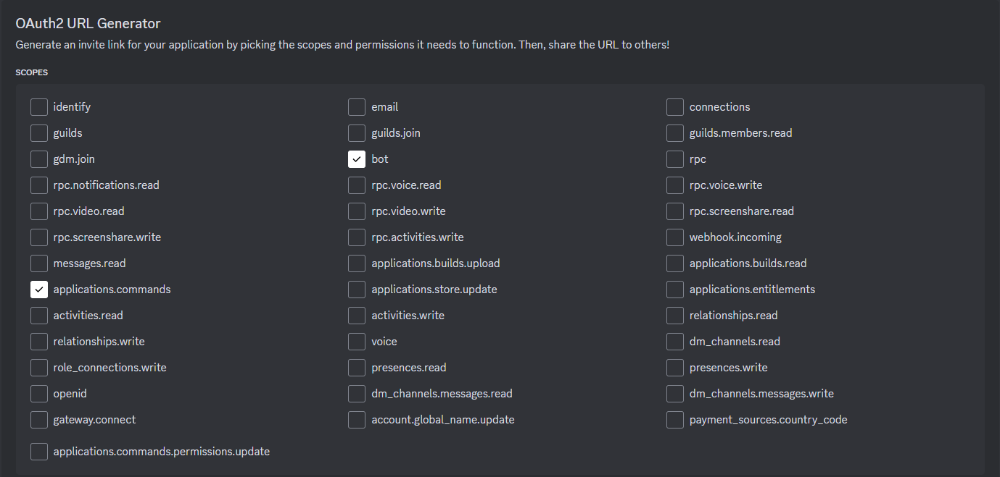
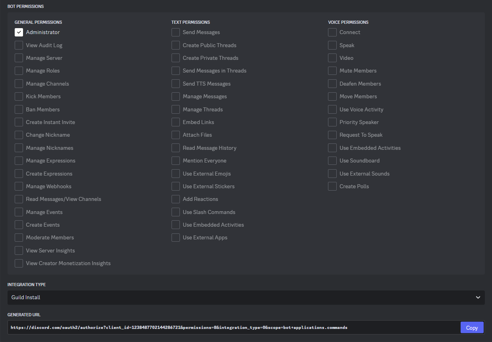
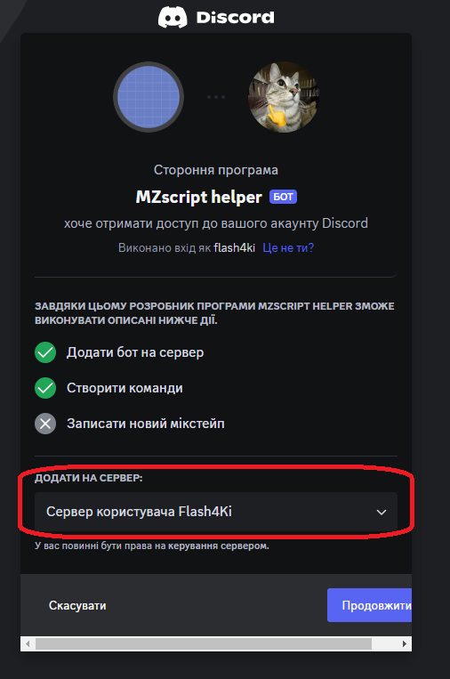

# Create Bot

## Create app on Discord Developers Portal

Go to **[Discord Developers Portal](https://discord.com/developers/applications/)** and create **New Application**  

On application page, open **"Bot"** category  

**Copy bot token** and **turn on all Intents**  

### DON'T SHOW YOUR TOKEN TO ANYONE  
If you reload or reopened "Bot" page, reset and copy token  

## Invite your bot

Open **OAuth2** category and create url to invite bot  

Copy and follow to **generated url**  

Choose your server where you have permissions and invite bot  

## Now you can give life for your bot together with MZscript!
See this [page](./create_bot2) that describes it more detailed  